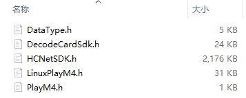

## HIKCamera图像获取接口

Ubuntu下利用python获取海康网络摄像头视频流。

include文件夹：



lib文件夹：


上述文件夹中文件均来自于海康官方SDK压缩包中：<https://www.hikvision.com/cn/download_more_403.html>

hkso.cpp、hkso.h为自定义的接口文件

类封装参考：<https://github.com/1996scarlet/IPCamera-CPython-Interface>

解析视频流参考：<https://blog.csdn.net/ding977921830/article/details/75272384>

build文件中为cmake文件，用于封装以上hkso文件成动态链接库libHKCamera_v1.so，便于python调用。

```shell
cd build/
cmake ./
make 
#生成的libHKCamera_v1.so在../lib中.
```

python文件利用ctype定义接口函数调用libHKCamera_v1.so动态库，其中interface.py为定义的接口文件，main.py为主程序。

待完善...

